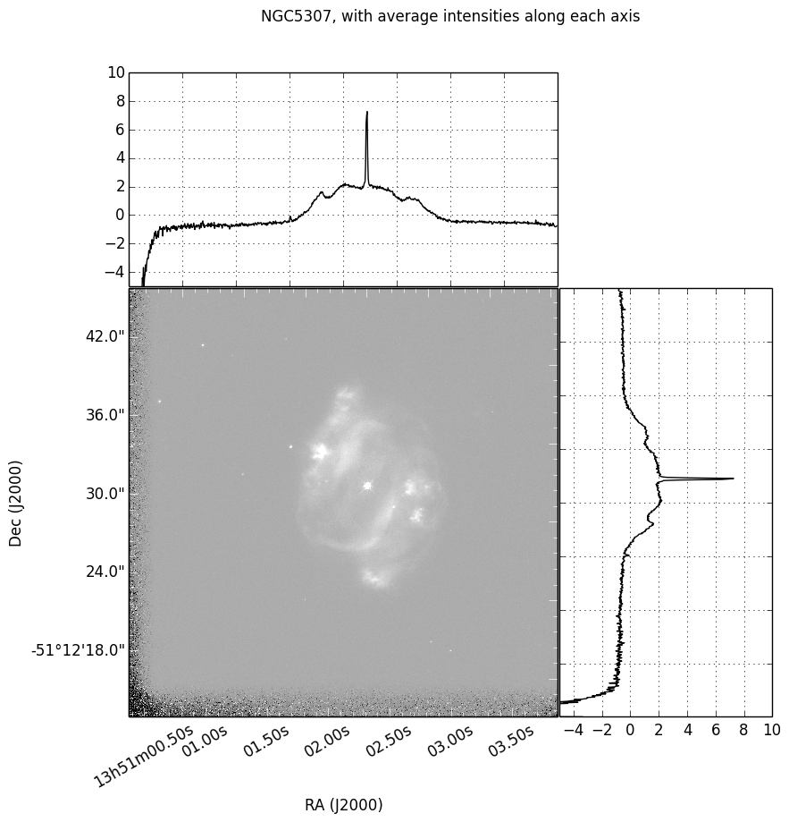

Creating subplots
-----------------

By default, :class:`~aplpy.aplpy.FITSFigure` creates a figure with a single
subplot that occupies the entire figure. However, APLpy can be used to place a
subplot in an existing matplotlib figure instance. To do this,
:class:`~aplpy.aplpy.FITSFigure` should be called with the ``figure=``
argument as follows::

    import aplpy
    import matplotlib.pyplot as mpl
    
     fig = mpl.figure()
     f = aplpy.FITSFigure('some_image.fits', figure=fig)
    
The above will place a subplot inside the ``fig`` figure instance. The ``f``
object can be used as normal to control the FITS figure inside the
subplot. The above however is not very interesting compared to just
creating a FITSFigure instance from scratch. What this is useful for is
only using sub-regions of the figure to display the FITS data, to leave
place for other subplots, whether histograms, scatter, or other matplotlib
plots, or another FITS Figure. This can be done using the ``subplot``
argument. From the docstring for FITSFigure::
    
    *subplot*: [ list of four floats ]
        If specified, a subplot will be added at this position. The list
        should contain [xmin, ymin, dx, dy] where xmin and ymin are the
        position of the bottom left corner of the subplot, and dx and dy are
        the width and height of the subplot respectively. These should all be
        given in units of the figure width and height. For example, [0.1, 0.1,
        0.8, 0.8] will almost fill the entire figure, leaving a 10 percent
        margin on all sides.
    
The following code outline illustrates how to create a rectangular figure with
two FITS images::

    import aplpy
    import matplotlib.pyplot as mpl

    fig = mpl.figure(figsize=(15, 7))

    f1 = aplpy.FITSFigure('image_1.fits', figure=fig, subplot=[0.1,0.1,0.35,0.8])
    f1.set_tick_labels_font(size='x-small')
    f1.set_axis_labels_font(size='small')
    f1.show_grayscale()

    f2 = aplpy.FITSFigure('image_2.fits', figure=fig, subplot=[0.5,0.1,0.35,0.8])
    f2.set_tick_labels_font(size='x-small')
    f2.set_axis_labels_font(size='small')
    f2.show_grayscale()

    f2.hide_yaxis_label()
    f2.hide_ytick_labels()

    fig.canvas.draw()
    
The ``hide`` methods shown above are especially useful when working with
subplots, as in some cases there is no need to repeat the tick labels. Alternatively figures can be constructed from both APLpy figures and normal matplotlib axes::

    import aplpy
    import matplotlib.pyplot as mpl

    fig = mpl.figure(figsize=(15, 7))

    f1 = aplpy.FITSFigure('image_1.fits', figure=fig, subplot=[0.1,0.1,0.35,0.8])
    f1.set_tick_labels_font(size='x-small')
    f1.set_axis_labels_font(size='small')
    f1.show_grayscale()

    ax2 = fig.add_axes([0.5,0.1,0.35,0.8])
    
    # some code here with ax2

    fig.canvas.draw()

Layouts can also be specified by the use of tuples of the form
(numrows, numcols, fignum) in the same manner as MATLAB and matplotlib.

Complex layouts can be specified with the use of ``GridSpec`` objects. For
example, the following code makes a 9 by 9 grid of axes, and uses a 2 by 2
slice (``gs[1:3, 0:2]``) to display a figure.::

    from astropy.io import fits
    from aplpy import FITSFigure
    import matplotlib.pyplot as plt
    import numpy as np
    from matplotlib.gridspec import GridSpec

    data = fits.open('F555W-u2sa2104b.c0.fits')[0]

    fig = plt.figure(figsize=(9,9))
    gs = GridSpec(3,3, hspace=0.01, wspace=0.01, left=0.1)

    gc = FITSFigure(data, subplot=gs[1:3, 0:2], slices=[0], figure=fig)
    gc.show_grayscale()
    for label in gc._ax1.get_xticklabels():
        label.set_rotation(30)

    ax1 = plt.subplot(gs[0, :2])
    ax1.plot(data.data[0].mean(axis=0), 'k')
    plt.setp(ax1.get_xticklabels(), visible=False)
    ax1.set_ylim(-5)
    ax1.grid()

    ax2 = plt.subplot(gs[1:, 2])
    ax2.plot(data.data[0].mean(axis=0), np.arange(len(data.data[0,:,0])), 'k')
    plt.setp(ax2.get_yticklabels(), visible=False)
    ax2.set_xlim(-5)
    ax2.grid()

    fig.suptitle('NGC5307, with average intensities along each axis')
    plt.savefig('gridspec-sample.png', bbox_inches='tight')

This produces a the following image:

