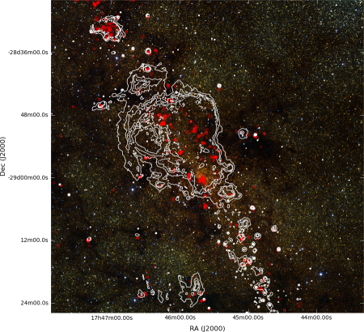

Beginner Tutorial
-----------------

.. toctree::
  :maxdepth: 1

The following tutorial will take you, step by step, through the main features
of APLpy. You will need to download the following `file <http://aplpy.github.com/downloads/tutorial.tar.gz>`_.

First, unpack the example files and go to the ``tutorial`` directory::

    tar -xvzf tutorial.tar.gz
    cd tutorial

Now, start up ``ipython``::

    ipython --pylab

 and import the ``aplpy`` module as follows::

    import aplpy

To start off, use the :class:`~aplpy.aplpy.FITSfigure` class to create a
canvas to where your data will be plotted::

    gc = aplpy.FITSFigure('fits/2MASS_k.fits')

and display the image using a grayscale stretch::

    gc.show_grayscale()

Check out the buttons at the top or bottom of the canvas (depending on the
version of matplotlib). You will see seven buttons:

The first five are of interest to us here. The button with the magnifying
glass will allow you to select an area on the plot and zoom in. To zoom out
you can click on the home button (first one on the left). When you're zoomed
in you can pan around by clicking on the button with the arrows (fourth button
from the left).

Use the following command to show a colorscale image instead::

    gc.show_colorscale()

The colormap used for the colorscale image can be changed. Try the following::

    gc.show_colorscale(cmap='gist_heat')

to show the image showing a 'heat' map. You can find more information in the 
:meth:`~aplpy.aplpy.FITSFigure.show_grayscale` and
:meth:`~aplpy.aplpy.FITSFigure.show_colorscale` documentation. For
example, you can control the minimum and maximum pixel values to show and the
stretch function to use.

It is possible to use APLpy to show 3-color images. To do this, you need a
FITS file with the image - this is used for the information relating to the
coordinates - and a PNG file containing the 3-color image. Both files need to
have exactly the same dimensions and the pixels from the PNG file have to
match those from the FITS file. An example is provided in the tutorial files.
Try the following::

    gc.show_rgb('graphics/2MASS_arcsinh_color.png')

It is very easy to modify the font properties of the various labels.
For example, in this case, we can change the font size of the tick
labels to be smaller than the default::

    gc.tick_labels.set_font(size='small')

APLpy can be used to overlay contours onto a grayscale/colorscale/3-color
image. Try typing the following command::

    gc.show_contour('fits/mips_24micron.fits', colors='white')

There are a number of arguments that can be passed to :meth:`~aplpy.aplpy.FITSFigure.show_contour` to
control the appearance of the contours as well as the number of levels to
show. For more information, see the see the :meth:`~aplpy.aplpy.FITSFigure.show_contour` documentation.

Display a coordinate grid using::

    gc.add_grid()

and hide it again using::

    gc.remove_grid()

Let's overplot positions from a source list. Here we will use loadtxt to read
in the coordinates from a file, but in general you can pass any pair of lists
or numpy arrays that are already defined::

    import numpy
    data = numpy.loadtxt('data/yso_wcs_only.txt')
    ra, dec = data[:, 0], data[:, 1]
    gc.show_markers(ra, dec, edgecolor='green', facecolor='none', 
                    marker='o', s=10, alpha=0.5)

For more information, see the :meth:`~aplpy.aplpy.FITSFigure.show_markers`
documentation.

It's often the case that you might want to change the look of a contour or
markers, but if you run :meth:`~aplpy.aplpy.FITSFigure.show_contour` or :meth:`~aplpy.aplpy.FITSFigure.show_markers` a second time, it
will overplot rather than replacing. To solve this problem APLpy has 'layers'
which can be manipulated in a basic way. Type::

    gc.list_layers()

which will print out something like this::

    There are 2 layers in this figure:

    -> contour_set_1
    -> marker_set_1

You can use :meth:`~aplpy.aplpy.FITSFigure.remove_layer`, :meth:`~aplpy.aplpy.FITSFigure.hide_layer`, and :meth:`~aplpy.aplpy.FITSFigure.show_layer` to manipulate
the layers, and you can also specify the ``layer=name`` argument to
:meth:`~aplpy.aplpy.FITSFigure.show_contour` or :meth:`~aplpy.aplpy.FITSFigure.show_markers`. Using the latter forces APLpy to name
the layer you are creating with the name provided, and can also be used to
replace an existing layer. For example, let's change the color of the markers
from green to red::

    gc.show_markers(ra, dec, layer='marker_set_1', edgecolor='red', 
                    facecolor='none', marker='o', s=10, alpha=0.5)

Note the presence of the ``layer='marker_set_1'`` which means that the
current markers plot will be replaced. To view active layers, you can use the :meth:`~aplpy.aplpy.FITSFigure.list_layers` documentation.

To wrap up this tutorial, we will save the plot to a file. Type the following::

    gc.save('myfirstplot.png')

This will produce the following file:

You can of course save it as a PS/EPS, PDF, or SVG file instead. The EPS
output is suitable for publication.

To summarize, the above plot was made using the following commands::

    import aplpy
    import numpy

    gc = aplpy.FITSFigure('fits/2MASS_k.fits')
    gc.show_rgb('graphics/2MASS_arcsinh_color.png')

    gc.tick_labels.set_font(size='small')

    gc.show_contour('fits/mips_24micron.fits', colors='white')

    data = numpy.loadtxt('data/yso_wcs_only.txt')
    ra, dec = data[:, 0], data[:, 1]

    gc.show_markers(ra, dec, layer='marker_set_1', edgecolor='red', 
                    facecolor='none', marker='o', s=10, alpha=0.5)

    gc.save('myfirstplot.png')

There are many more methods and options, from setting the tick spacing and
format to controlling the label fonts. For more information, see the :doc:`quick_reference` or the :ref:`api`.