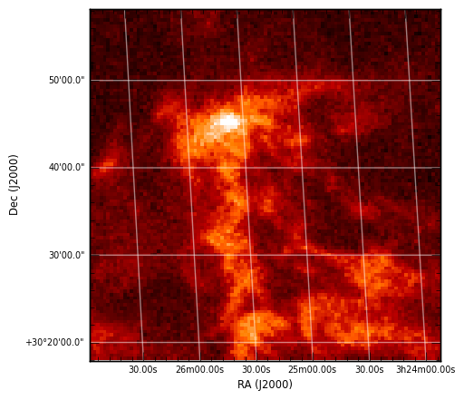
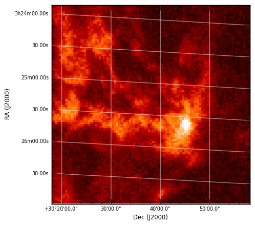
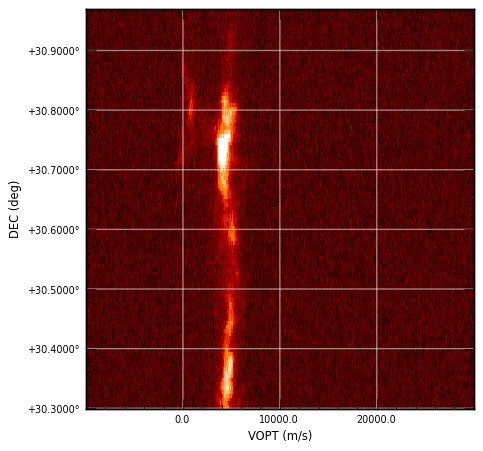

Slicing multi-dimensional data cubes
====================================

How to slice data cubes
-----------------------

APLpy supports extracting a slice from n-dimensional FITS cubes, and
re-ordering dimensions. The two key arguments to
:class:`~aplpy.aplpy.FITSFigure` to control this are ``dimensions`` and
``slices``. These arguments can also be passed to :meth:`~aplpy.aplpy.FITSFigure.show_contour`.

The ``dimensions`` argument is used to specify which dimensions should be used
for the x- and y-axis respectively (zero based). The default values are ``[0,
1]`` which means that the x-axis should use the first dimension in the FITS
cube, and the y-axis should use the second dimension. For a 2-dimensional FITS
file, this means that one can use ``[1, 0]`` to flip the axes. For a FITS cube
with R.A., Declination, and Velocity, ``[0, 2]`` would make a R.A.-Velocity
plot.

The ``slices`` argument gives the pixels slice to extract from the remaining
dimensions, skipping the dimensions used, so ``slices`` should be a list with
length n-2 where n is the number of dimensions in the FITS file. For example,
if one has a FITS file with R.A., Declination, Velocity, and Time (in that
order), then:

* ``dimensions=[0, 1]`` means the plot will be an R.A-Declination plot, and
  ``slices=[33, 56]`` means that pixel slices 33 and 56 will be used in
  Velocity and Time respectively (in this case, ``dimensions`` does not need
  to be specified since it defaults to ``[0, 1]``)

* ``dimensions=[0, 2]`` means the plot will be an R.A-Velocity plot, and
  ``slices=[22, 56]`` means that pixel slices 22 and 56 will be used in
  Declination and Time respectively.

* ``dimensions=[3, 2]`` means the plot will be a Time-Velocity plot, and
  ``slices=[10, 22]`` means that pixel slices 10 and 22 will be used in R.A
  and Declination respectively.

See :ref:`arbitrary` for information on formatting the labels when
non-longitude/latitude coordinates are used.

Aspect ratio
------------

When plotting images in sky coordinates, APLpy makes pixel square by default,
but it is possible to change this. When calling
:meth:`~aplpy.aplpy.FITSFigure.show_grayscale` or
:meth:`~aplpy.aplpy.FITSFigure.show_colorscale`, simply add ``aspect='auto'``
which will override the ``aspect='equal'`` default. The ``aspect='auto'`` is
demonstrated below.

Example
-------

The following script demonstrates this functionality in use::

    import matplotlib
    matplotlib.use('Agg')

    import aplpy

    f = aplpy.FITSFigure('L1448_13CO.fits.gz', slices=[222],
                         figsize=(5,5))
    f.show_colorscale()
    f.add_grid()
    f.tick_labels.set_font(size='xx-small')
    f.axis_labels.set_font(size='x-small')
    f.save('slicing_1.png')

::

    f = aplpy.FITSFigure('L1448_13CO.fits.gz', slices=[222],
                         dimensions=[1, 0], figsize=(5,5))
    f.show_colorscale()
    f.add_grid()
    f.tick_labels.set_font(size='xx-small')
    f.axis_labels.set_font(size='x-small')
    f.save('slicing_2.png')

::

    f = aplpy.FITSFigure('L1448_13CO.fits.gz', dimensions=[2, 1],
                         slices=[50], figsize=(5,5))
    f.show_colorscale(aspect='auto')
    f.add_grid()
    f.tick_labels.set_font(size='xx-small')
    f.axis_labels.set_font(size='x-small')
    f.tick_labels.set_xformat('%.1f')
    f.save('slicing_3.png')

